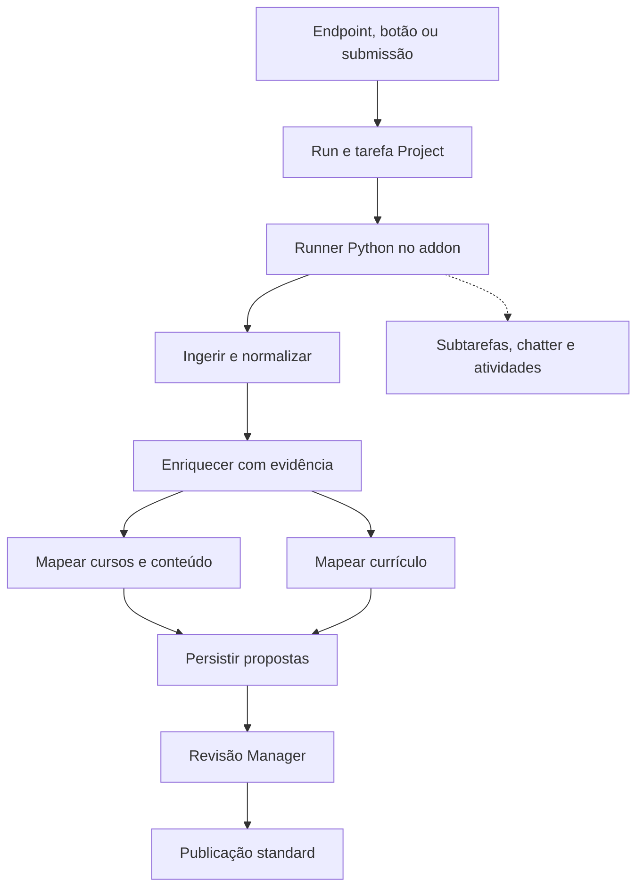

# FACODI API — especificação ponta a ponta

Data: 2026-10-06. Estado: proposta para implementação. Requisito do utilizador: um único addon Python, funções de processamento expostas como endpoints e toda execução refletida em Odoo Project standard.

## 1. Resultado e critérios de sucesso

O contribuidor envia um recurso com contexto de curso/UC. Recebe rapidamente um identificador consultável. A equipa acompanha ingestão, enriquecimento, mapping, revisão e publicação em tarefas e subtarefas standard. Resultados são rastreáveis até texto/segmentos reais e versões dos serviços. O conteúdo só entra na projeção editorial aprovada após ações autorizadas do Manager.

Sucesso M1: ingestão YouTube e replay seguros com Project. M2: enriquecimento e mapping de conteúdo/UC contra catálogo existente, com evidência. M3: integração editorial, upgrade e recuperação demonstrados em staging. O desempenho é medido por etapa; não há promessa de tempo total independente de YouTube, rede ou LLM.

## 2. Inventário confirmado no GitHub

| Componente | Observação no snapshot de 2026-10-06 |
| --- | --- |
| `marcelo-m7/facodi-api` | `main` em `05d6cb7fcc81e369646a6070e658a40b1d931c8b`; addon `19.0.1.0.0`; depende de `base`, `web` |
| API existente | `/facodi/api/v1/health`, `/supabase/webhook`, `/stripe/webhook`; registry Supabase, Stripe e Abacate; `FacodiApiService` encaminha ingestão/análise/metadata a Supabase |
| `marcelo-m7/facodi-deploy` | `main` em `fe6a795d6eae077505c98a01ebfbb3d786b4fe74`; gitlink `addons/facodi-api` já aponta ao SHA acima |
| Runtime | Compose ativo `deploy/coolify/docker-compose.yml`; `db -> migrate -> odoo`; `FACODI_MODULES` não inclui explicitamente `facodi_api` |
| Dependências Python | Docker cria `/opt/facodi-venv` com pacotes Odoo do sistema; instala requirements de `facodi-ai` e PyJWT; ainda não requirements de `facodi-api` |
| Domínio existente | `facodi_learning` já tem submissões, fontes, candidatos, analysis jobs/attempts/results, mappings, curriculum references/units/coverage/modules |
| Provider atual no deploy | par `SUPABASE_URL`/`SUPABASE_SECRET_KEY` ativa `supabase_edge`; ausência retorna a `local_metadata` |

Inventário de fonte, não prova de módulos instalados ou comportamento atual de produção. README de deploy não lista ainda o gitlink API na sua tabela; o gitlink e Compose são a evidência para esta proposta.

## 3. Alternativas e decisão proposta

| Opção | Vantagem | Custo | Decisão |
| --- | --- | --- | --- |
| Um `facodi_api` com controllers + engine Python + adaptadores de domínio | funções próximas, instalação e operação simples, corresponde ao pedido | cron e runtime Odoo impõem limites de CPU/tempo | adotar inicialmente |
| Dois addons API/engine | instala transporte sem engine | mais dependências e versões sem necessidade demonstrada | reservar para separação futura |
| Engine externo/Supabase obrigatório | isolamento e escala independentes | não corresponde à direção atual; aumenta coordenação | manter apenas compatibilidade transitória |

Um único addon novo não significa copiar o domínio existente. Dependências propostas: `base`, `web`, `mail`, `project`, `website_slides`, `facodi_learning`, `facodi_ai`. `facodi_learning` e `facodi_ai` continuam independentes de `facodi_api`, evitando dependência circular. `facodi_api` estende os pontos de extensão existentes para engine e Project. Pagamentos continuam compatíveis e separados da pipeline editorial.

## 4. Arquitetura

Controllers apenas autenticam, validam DTOs, verificam acesso e enfileiram. Serviços Python usam entradas/saídas tipadas, sem depender da request HTTP. O runner persiste transições e executa uma etapa limitada por vez. Adaptadores ORM fazem o handoff aos modelos e ações de `facodi_learning`. O projeto é o espelho humano da operação; os seus estados não substituem a máquina técnica.

## 5. Estrutura de ficheiros proposta

Preservar `service.py`, `provider/` e `controllers/api.py` como interface de compatibilidade. Acrescentar:

- `controllers/pipeline.py`: REST JSON e consulta autorizada;
- `schemas/dto.py`: dataclasses imutáveis e validação explícita;
- `services/ingestion/{service,youtube,markitdown,safe_fetch}.py`: aquisição segura e conversão;
- `services/normalization.py`: Markdown canónico e segmentos;
- `services/enrichment.py`: chunks, conceitos e integração auditada com `facodi_ai`;
- `services/mapping/{service,snapshot,ranking}.py`: alvos limitados e evidência;
- `services/pipeline/{registry,runner}.py`: lista fixa de pipelines e DAG;
- `services/domain_adapter.py`: resultado e propostas nos modelos existentes;
- `models/{pipeline_run,pipeline_step,pipeline_artifact,project_task,analysis_job,submission}.py`: metadados de execução, integração por herança;
- `security/pipeline_security.xml`, `data/{pipeline_project,ir_cron}.xml`, `views/{pipeline,project_task,res_config_settings}_views.xml`;
- `facodi_api/tests/`: testes Odoo; `tests/`: testes puros offline; `requirements.in`/`requirements.lock`: dependências verificadas.

## 6. Funções e pipelines

Capabilities públicas: `ingest`, `enrich`, `map`, `pipeline/content`. Pipelines do registry: `youtube_video_v1`, `document_v1`. Playlist é uma extensão posterior com run agregador e limite de itens; não enumerar silenciosamente uma playlist recebida num endpoint de vídeo.

Etapas do pipeline completo: `ingest -> normalize -> enrich -> {map_courses, map_curriculum} -> persist -> review -> publish`. Ramos de mapping são independentes no DAG, mas o runner M1 usa concorrência 1; não promete paralelismo de execução. Etapas internas são funções, não quarenta endpoints.

Ingestão pode ser executada sozinha e terminar `succeeded` com documento. Enrich/map recebem `artifact_id` interno autorizado; não confiam em Markdown arbitrário, provenance ou IDs enviados pelo cliente. O pipeline completo termina o processamento automático em `review_required`, aguarda decisões e fica `ready` para publicação explícita.

## 7. Objetos persistidos

| Modelo | Responsabilidade |
| --- | --- |
| `facodi.api.pipeline.run` — novo | UUID, capability, versão, company/website, ator, submissão existente opcional, contexto autorizado, provider congelado, idempotência, estado, parent task, duração e erro seguro |
| `facodi.api.pipeline.step` — novo | run, key, dependências, tentativa, estado técnico, timestamps, próxima tentativa, ownership de claim, subtarefa e referências a artefactos |
| `facodi.api.pipeline.artifact` — novo | conteúdo pré-slide imutável, hash, tipo/schema, producer, run, attachments privados e snapshot do catálogo |
| `project.project` / `project.task` — standard | equipa, responsáveis, tarefa principal/subtarefas, dependências, milestones, atividades e chatter |
| `facodi.learning.submission/source/candidate` — existentes | identidade, consentimento/contexto, fonte e resolução editorial do alvo |
| `facodi.learning.analysis.job/attempt/result` — existentes | quando há `slide.slide`, reusar job/provider registry e output imutável; referência ao run, sem segunda análise concorrente |
| mappings/coverage/module items — existentes | propostas, revisão e composição curricular; não duplicar tabelas de domínio |
| `slide.channel`, `slide.slide`, `slide.tag` — standard | curso, conteúdo canónico e tags revisadas |

Artefactos pre-slide justificam apenas armazenamento técnico: não criar um novo curso, submissão ou analysis result concorrente. Hash nunca basta para autorizar acesso entre utilizadores. O adapter invoca as ações de domínio existentes; não chama `create()` em analysis result, cujo código bloqueia criação pública, nem escreve estado final diretamente. `_record_output` e helpers de proposta só são usados dentro da integração auditada após validar ator e origem.

## 8. Enriquecimento e mapping

Baseline: limpeza, chunks, termos e classificação determinística. Sem provider IA, resultado declara `analysis_depth=metadata` ou `transcript`; nunca atribuir resumo/conceitos inventados. Com provider configurado, usar o serviço existente `facodi_ai`, saída estruturada e chunks numerados. Capturar modelo, prompt, configuração, input hash e custos quando reportados. Mesmo input não garante mesmo texto LLM: preservar a saída imutável e reutilizar cache versionada.

Mapping recebe um snapshot apenas de cursos/conteúdos/UCs autorizados na mesma company/website. Contexto do CTA limita busca, mas não é aprovação. Recuperação lexical inicial limita a 100 alvos; ranking devolve até 10 por tipo. Score inicial é um valor de ranking não calibrado, nunca probabilidade de acerto. Cada candidato tem alvo existente, relação, score [0,1], justificação, evidence chunk/segment IDs e versão do snapshot. Não gerar IDs curriculares, ECTS ou requisitos oficiais a partir da transcrição.

Relações de cursos seguem o enum existente: `related`, `alternative`, `continuation`, `complements`, `equivalent`, `prerequisite`. Coverage segue `covers`, `partial`, `supports`, `equivalent`. Para vídeo sem curso resolvido, candidato à UC fica no artefacto até o editor resolver o `channel_id` exigido pelo modelo coverage. Não criar um curso vazio para satisfazer a FK. Relação conteúdo-conteúdo usa `facodi.learning.mapping`, cujo enum confirmado é `related`, `prerequisite`, `recommended`, `supports`; exige source/target slides distintos e provenance de análise.

## 9. Revisão/publicação

Persistir sugestões como propostas. Reviewer é eLearning Manager; executor é um utilizador técnico interno sem publicação. Cada aprovação usa ação ORM existente; score alto não autoriza aprovação automática. Se o catálogo mudar após mapping, publicação revalida alvo, visibilidade e revisão. Alterar um card de Project para Done não publica nem aprova: ações explícitas fazem a operação e só depois sincronizam Project.

Publicação exige Manager, conteúdo canónico resolvido, revisão explícita e preflight de Website/visibilidade. Pode publicar conteúdo com mapping opcional rejeitado se a decisão editorial o permitir e estiver registada; não representar essa relação como aprovada. Coverage não concede equivalência académica.

## 10. Segurança, operação e rollout

Contratos em [contracts.md](../../facodi-api/contracts.md), espelho Project em [odoo-project.md](../../facodi-api/odoo-project.md), limites/retries em [execution-security.md](../../facodi-api/execution-security.md). Release em `facodi-deploy`: integrar pins revistos, instalar dependências no build, seleção explícita `odoo_python`, nunca inferida das credenciais Supabase, validar fresh/upgrade/replay e preservar `db -> migrate -> odoo` e backups emparelhados.

Webhooks atuais têm gaps confirmados no código: Supabase só verifica HMAC quando secret e signature estão presentes; Stripe aceita payload sem validar assinatura. Corrigir fail-closed antes de disponibilizar novas superfícies. Não houve teste de exploração nem alteração dos endpoints nesta entrega.

## 11. Fora do primeiro release

ASR local pesado, download de áudio/vídeo, treino de embeddings, vector DB obrigatório, GPU/Rust/FFI, microserviços, queue genérica, aprovação automática, playlist ilimitada, reformulação do frontend e pagamentos novos. PDF/DOCX entram em M2 pelo mesmo contrato; conteúdos sem extração suficiente pedem intervenção.

## 12. Aceitação global

- Mesmo idempotency key/body/ator devolve mesmo run; key/body diferente é 409; concorrência não duplica.
- Cada run e etapa têm tarefa/subtarefa única; retries preservam história e relações.
- Legenda original com timestamps vira artefacto rastreável; ausência não se torna análise completa.
- Alvos e decisões existentes são preservados, mapping apenas proposto.
- Falhas e restart são recuperáveis sem duplo efeito; segredo nunca aparece em outputs.
- Autorização por ator/company/website cobre jobs, artefactos, tasks e attachments.
- Instalação limpa, upgrade e segundo upgrade preservam páginas, progresso, anexos e reviews.
- Benchmarks distinguem cache, aquisição, IA, fila e ORM; metas são validadas, não anunciadas como medidas.

Fontes técnicas e limitações: [libraries.md](../../facodi-api/libraries.md). Engenharia: [plano](../plans/2026-10-06-facodi-api.md).
